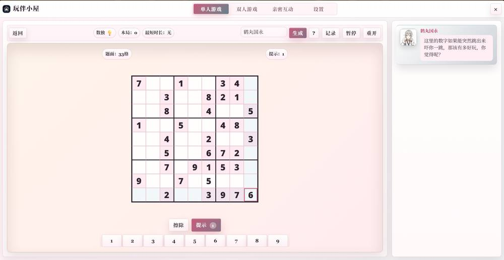
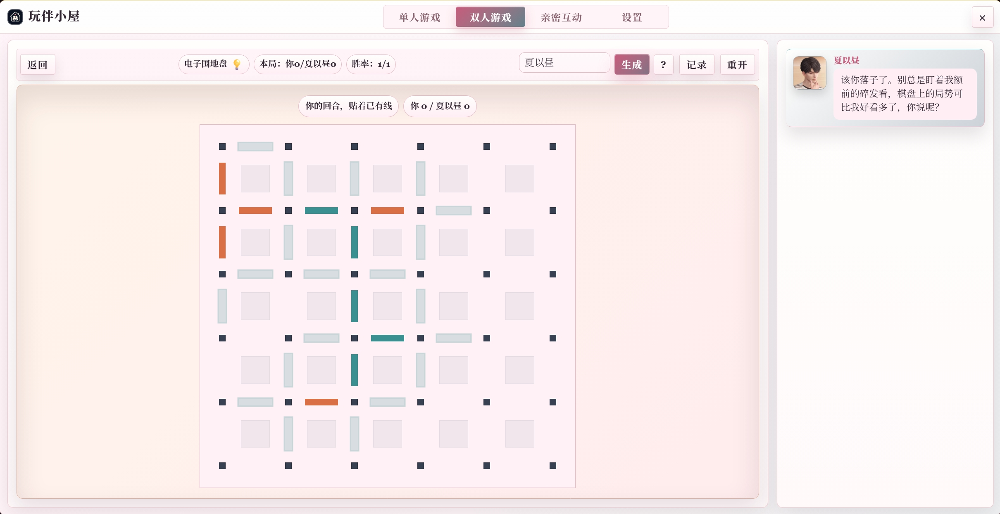
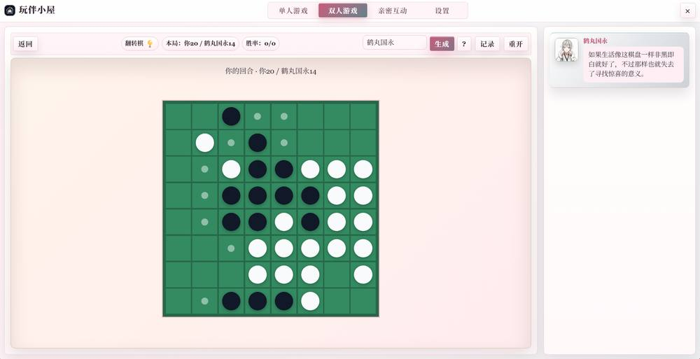
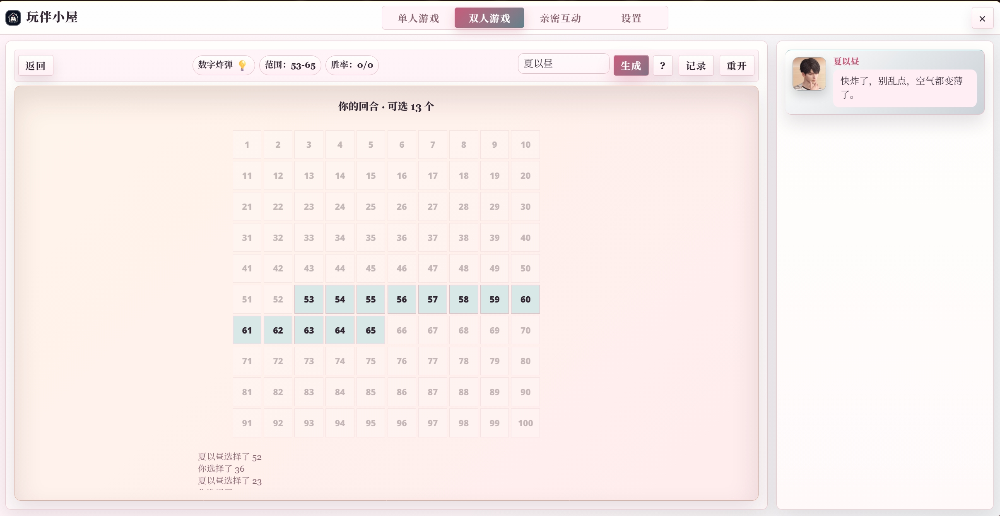
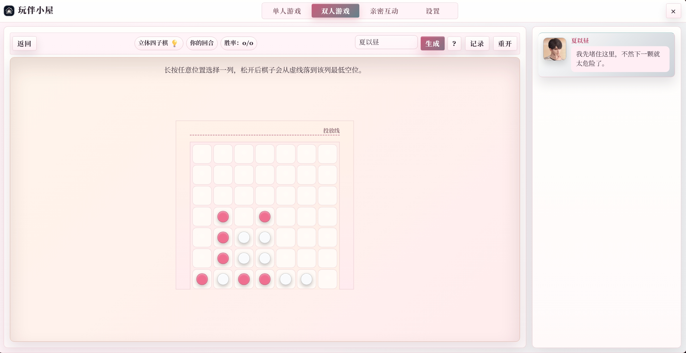

# 玩伴小屋

一个可以在 SillyTavern 里打开的小小游戏屋。等正文生成、等回复、想摸鱼的时候，都可以顺手来一把。

<p align="center">
  
</p>

## 目录

- [简介](#简介)
- [游戏目录](#游戏目录)
  - [单人游戏](#单人游戏)
  - [双人游戏](#双人游戏)
  - [亲密互动](#亲密互动)
- [陪伴系统](#陪伴系统)
- [快速上手攻略](#快速上手攻略)
- [常见问题](#常见问题)
- [更新日志](#更新日志)

## 简介

玩伴小屋支持电脑端和手机端，会根据窗口大小自动调整布局。

目前内置 4 套掌机风格主题：

- 【日】梦幻掌机
- 【日】春野物语
- 【夜】霓虹游戏舱
- 【夜】赛博街机

它一开始只是用来在酒馆生成正文时消磨时间的小游戏插件。现在不止能玩游戏，还可以一边玩一边听 char 吐槽、夸你、嘴硬、记仇，陪伴感会更强一点。

喜欢的话可以点点 ⭐。如果大家玩得多，也会考虑继续加更多游戏和互动功能。

## 游戏目录

目前游戏分成三栏：单人游戏、双人游戏、亲密互动。

### 单人游戏

单人游戏更偏向「自己玩，char 在旁边看」。语录会更像碎碎念、提醒、吐槽和小声陪跑。

#### 俄罗斯方块

<p align="center">
  
</p>

规则和流程：

1. 方块会从上方不断落下。
2. 你可以左右移动、旋转，也可以主动加速下落。
3. 横向凑满一整行后，该行会消除并得分。
4. 一次消除多行会得到更高分。
5. 方块堆到顶部时游戏结束。

#### 贪吃蛇

<p align="center">
  
</p>

规则和流程：

1. 控制小蛇上下左右移动。
2. 吃到食物会加分，蛇身也会变长。
3. 分数越高，蛇的速度越快。
4. 撞墙或撞到自己的身体就会结束。
5. 目标是吃得更多、活得更久。

#### 2048

<p align="center">
  
</p>

规则和流程：

1. 上下左右滑动棋盘。
2. 相同数字撞到一起会合并成更大的数字。
3. 每移动一次，棋盘会新增一个数字块。
4. 尽量把最大数字稳定放在角落。
5. 棋盘被塞满且无法移动时结束。

#### 合成大西瓜

<p align="center">
  
</p>

规则和流程：

1. 选择位置投放水果。
2. 相同水果碰到一起会合成更大的水果。
3. 水果会滚动、挤压、堆叠，落点很重要。
4. 成功合成最终大西瓜会触发特殊语录。
5. 水果堆超过顶部警戒线时结束。

#### 翻牌记忆

<p align="center">
  
</p>

规则和流程：

1. 牌面初始全部扣住。
2. 每次翻开两张牌。
3. 如果两张图案相同，就会配对成功并保留翻开。
4. 如果不同，会短暂展示后重新扣回去。
5. 全部配对完成后结算，步数越少越好。

#### 跳一跳

<p align="center">
  
</p>

规则和流程：

1. 按住屏幕或按键开始蓄力。
2. 松开后角色会跳向下一个平台。
3. 蓄力越久，跳得越远。
4. 落到平台上就得分，越接近中心越漂亮。
5. 没落到平台上就会结束。

#### 搭木板

<p align="center">
  
</p>

规则和流程：

1. 长按屏幕或空格生成木板。
2. 松开后木板会倒下，变成通向下一根柱子的桥。
3. 木板太短会够不到，太长会走过头。
4. 刚好搭到柱子中心附近会触发更好的反馈。
5. 角色掉下去时游戏结束。

#### 数独

<p align="center">
  
</p>

规则和流程：

1. 每局会自动生成唯一解数独。
2. 点击空格后输入 1-9。
3. 同行、同列、同宫不能出现重复数字。
4. 可以擦除，也可以点击求助。
5. 填满且全部正确后完成；如果填满但有错，会提示你继续修改。

### 双人游戏

双人游戏会让你和 char 轮流行动。语录更偏互动，会根据胜负、堵路、抽牌、危险局面等事件变化。

#### 双人飞行棋

<p align="center">
  
</p>

规则和流程：

1. 开局会决定谁先手。
2. 掷到 6 点可以让停机坪里的棋子起飞。
3. 棋子按骰子点数沿路线前进。
4. 落到对方棋子所在格时，可以把对方撞回家。
5. 四枚棋子全部到达终点的一方获胜。

#### 猜数字

<p align="center">
  
</p>

规则和流程：

1. char 会想好一个四位不重复数字。
2. 你每次输入一个四位不重复数字。
3. 系统会提示「数字对几个、位置对几个」。
4. 数字对表示猜中了某个数字，位置对表示数字和位置都对。
5. 猜出完整顺序就获胜。

#### 我说你猜

<p align="center">
  
</p>

规则和流程：

1. char 会给出一个词语题目。
2. 每题最多有多条描述，可以逐条解锁。
3. 你可以随时输入答案。
4. 猜不中时会保留猜测记录，也可以继续看下一条描述。
5. 一局多题，猜中题数更多就算赢。

提示：这个游戏支持为当前角色生成专属题库。没有生成时会先使用默认题库。

#### 井字棋

<p align="center">
  
</p>

规则和流程：

1. 开局会决定谁先手。
2. 你和 char 在 3×3 棋盘里轮流落子。
3. 横、竖、斜任意方向先连成三格就获胜。
4. 棋盘下满但无人连线则平局。
5. 中心格、角落格、最后一步获胜等局面会触发不同互动。

#### 五子棋

<p align="center">
  
</p>

规则和流程：

1. 开局会决定谁先手。
2. 双方轮流在棋盘上落子。
3. 横、竖、斜任意方向先连成五子的一方获胜。
4. 三连、四连、堵棋、强威胁都会影响 char 的反应。
5. 棋盘下满无人五连则平局。

#### 电子围地盘

<p align="center">
  
</p>

规则和流程：

1. 双方轮流在点阵之间画边。
2. 谁画下一个小方格的第 4 条边，谁就占领该格。
3. 占领方格后可以继续行动。
4. 后期没有安全边时，每一步都可能给对方送分。
5. 所有边画完后，占领格子更多的一方获胜。

#### 抽鬼牌

<p align="center">
  
</p>

规则和流程：

1. 双方初始获得一组手牌，其中包含一张鬼牌。
2. 开局会自动消去已有对子。
3. 你从 char 手牌里抽一张，char 再从你手牌里抽一张。
4. 抽到能配对的牌就会消去。
5. 最后谁手里留下鬼牌，谁就输了。

#### 翻转棋

<p align="center">
  
</p>

规则和流程：

1. 使用 8×8 棋盘，双方轮流落子。
2. 新棋子和己方棋子夹住的对方棋子会被翻转。
3. 没有合法落子时会跳过本回合。
4. 角落非常重要，大量翻子也会触发特殊反馈。
5. 棋局结束后，棋子数量更多的一方获胜。

#### 数字炸弹

<p align="center">
  
</p>

规则和流程：

1. 1-100 中会藏着一个炸弹数字。
2. 双方轮流点击当前范围内的数字。
3. 点到安全数字后，可选范围会缩小。
4. 点到炸弹数字的人失败。
5. 范围越小越紧张，最后只剩一个选择时很有节目效果。

#### 立体四子棋

<p align="center">
  
</p>

规则和流程：

1. 双方轮流在 7×7 棋盘上选择横向位置投放棋子。
2. 棋子会从上方落到该列最低的空位。
3. 横向、纵向或斜向连成四个同色棋子即可获胜。
4. 三连、堵路、即将四连都会触发互动。
5. 棋盘填满且无人连成四子则平局。

### 亲密互动

<p align="center">
  
</p>

亲密互动目前还没有正式生成，想做成一个强互动专题。

目前构思中：

- 真心话大冒险：还在构思。如果每个题目都实时生成，会比较消耗 API 次数，所以会再想想更省的方式。
- 一起养宠物：偏长期陪伴，可以根据不同阶段生成对应的陪伴剧情，两个人一起养一只神秘宠物。
- 一起种田：想做一点轻松经营感，适合长线互动。

## 陪伴系统

### 角色语录

角色语录会根据游戏事件触发。

单人游戏里，char 更像坐在旁边看你玩，会在开局、得分、失误、危险、破纪录、结束时碎碎念。

双人游戏里，char 会参与对局，所以语录更偏互动。比如飞行棋撞回家、五子棋堵棋、抽鬼牌抽到鬼牌、数字炸弹范围变窄，都可能有不同反应。

### 小剧场

游戏结束后，小剧场有概率触发。

普通结算会按胜负、分数生成互动。特殊事件会触发特殊小剧场，比如破纪录、连赢三场、连输三场、惜败、险胜、超级厉害、超级菜、命中注定、气急败坏等。

### 游戏日志

完成一场游戏后，角色可以记录一条日志。

日志可以在每个游戏右上角的「记录」里查看。你也可以选择手动点「生成日志」，或者在设置里打开「自动记录日志」。

### char 的记忆

char 的语录和日志可以结合这些内容定制：

- user 信息
- char 信息
- 当前角色卡描述
- 世界书条目
- 大总结
- 前几次同角色同游戏日志

每个游戏会读取最近 5 次同角色同游戏日志。如果你有生成日志，char 后续就会像真的记得之前一起玩过一样。

## 快速上手攻略

### 只想当小游戏插件

不想和 char 互动，只想打开玩小游戏的话：

1. 进入「设置」。
2. 关闭「开启陪伴模式」。
3. 直接返回单人游戏或双人游戏开玩。

这样就不会生成语录、小剧场和日志，使用起来更轻。

### 保留上一次窗口

打开「保留上一次窗口」后：

1. 玩到一半关闭玩伴小屋。
2. 下次再打开，会回到上一次所在的游戏界面。
3. 如果该游戏有未结束进度，会提示你继续上次或重新开始。

### RP 正文完成提醒

打开「RP正文完成提醒」后，酒馆正文生成结束时会弹窗提醒你回去看文。

你还可以设置正文标签，例如：

```text
<content>正文内容</content>
```

这样每次弹窗会优先展示标签里的正文内容，方便先瞄一眼生成了什么。

### 完整陪伴流程

推荐流程：

1. 进入「设置」，开启「陪伴模式」。
2. 建议开启「小剧场」。
3. 日志可以手动生成，也可以打开「自动记录日志」。

<p align="center">
  
</p>

4. 设置 API。常用 API 建议选便宜好用的 flash 类模型，语录和日志一般够用了。
5. 进入「世界观注入」，先确认当前角色卡。
6. 填写或导入 user 信息。
7. char 信息默认会读取当前角色卡角色描述，也可以手动添加。
8. 可选：保存头像、选择世界书、导入大总结。
9. 全部设置好后，点击「保存为当前角色卡配置」。
10. 下次进入其他角色卡，也可以载入对应角色信息。

<p align="center">
  
</p>

### 预生成角色数据

建议提前把内容生成好，再开始玩。

推荐方式：

1. 进入「设置」。
2. 在「游戏语录设置」里点击「批量生成角色数据」。
3. 选择想玩的游戏。
4. 选择要生成「语录」还是「小剧场」，也可以一起生成。
5. 点击生成并覆盖。

<p align="center">
  
</p>

也可以进入某个游戏后，点击游戏界面的「生成」按钮。这个入口不能单独设置 API，会使用主 API 配置生成。

<p align="center">
  
</p>

游戏结束后的「生成日志」按钮需要手动点击才会生成，除非你已经开启「自动记录日志」。生成后的日志可以在「记录」里查看。

<p align="center">
  
</p>

### 游戏界面帮助

<p align="center">
  
</p>

游戏界面常用按钮：

- 「返回」：回到游戏列表。
- 「💡」：查看当前游戏规则。
- 「生成」：为当前游戏生成角色语录和小剧场。
- 「记录」：查看历史记录和游戏日志。
- 「暂停」：暂停当前游戏。
- 「重开」：重新开始当前游戏。

## 常见问题

### 每个游戏都要消耗 API 吗？

如果开启陪伴并使用生成内容，是的。每款游戏通常至少会消耗 2 类内容：语录生成和小剧场生成。
不过它们是预生成的，一次会生成多条语录/小剧场，可以反复玩几次。看腻了再重 roll 就好。

### 推荐什么模型？

目前测试下来，语录用 Gemini 3 Flash 这类 flash 模型就可以。
小剧场如果想要更细腻的体验，可以试 Gemini 3.1 Pro / 2.5 Pro 这类更强的模型。但因为消耗次数比较多，flash 也完全能用。

### 失败或截断怎么办？

目前没有特别好的办法，可能就是模型抽风或输出被截断了。
可以重 roll，批量生成界面里有「一键选择失败和没有选择的」这类操作，用起来会方便一点。

### 为什么我的 char 在这里很黏人？

因为默认提示词会偏向二人亲密关系的互动。
如果不想要这种感觉，可以在「批量生成角色数据」里修改语录提示词，让它更日常、更冷淡、更朋友向，或者更符合你的角色关系。

### 小剧场可以用自己的文风或预设吗？

可以。
在「批量生成角色数据」里可以修改小剧场提示词。想要固定文风、称呼、叙事习惯、互动尺度，都可以写进去。

### 我还想要 XXX 功能？

欢迎来社区许愿。
想要更多夸夸、更多小游戏、更多亲密互动、更多长期养成，都可以说~
受欢迎的话会继续开发www

## 更新日志

### 
