# 玩伴小屋

一个可以在 SillyTavern 里打开的小小游戏屋。等正文生成、等回复、想摸鱼的时候，都可以顺手来一把。

<p align="center">
  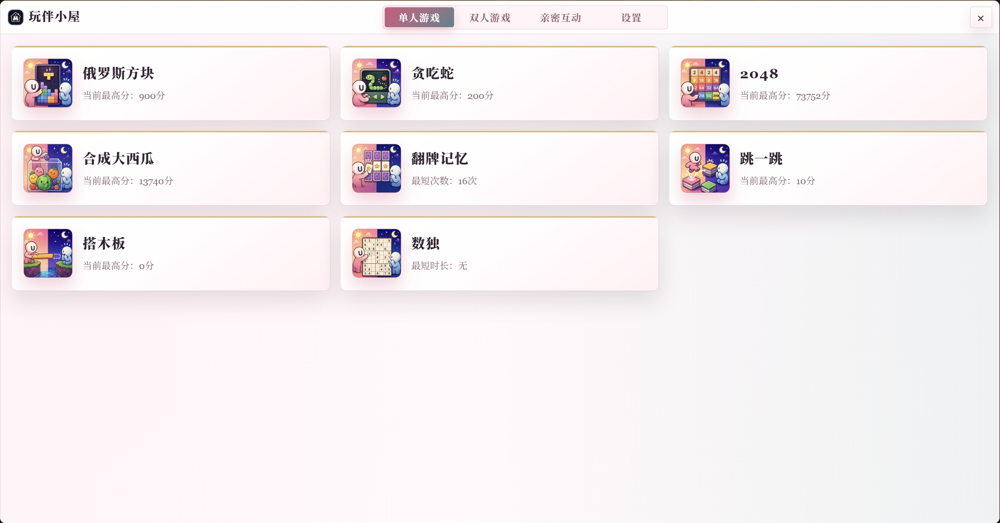
</p>

## 目录

- [简介](#简介)
- [游戏目录](#游戏目录)
  - [单人游戏](#单人游戏)
  - [双人游戏](#双人游戏)
  - [亲密互动](#亲密互动)
- [灵息小窝养宠模块](#灵息小窝养宠模块)
- [陪伴系统](#陪伴系统)
- [快速上手攻略](#快速上手攻略)
  - [角色切换](#角色切换)
- [常见问题](#常见问题)
- [更新日志](#更新日志)

## 简介

玩伴小屋支持电脑端和手机端，会根据窗口大小自动调整布局。当前版本：V3.7.0。

目前内置 7 套掌机风格主题，并支持跟随酒馆美化主题：

- 【日】梦幻掌机
- 【日】晴日信箱
- 【日】春野物语
- 【日】黑白像素
- 【夜】霓虹游戏舱
- 【夜】赛博街机
- 【夜】红黑牌剧场
- 跟随酒馆美化主题

它一开始只是用来在酒馆生成正文时消磨时间的小游戏插件。现在不止能玩游戏，还可以一边玩一边听 char 吐槽、夸你、嘴硬、记仇，陪伴感会更强一点。

喜欢的话可以点点 ⭐。如果大家玩得多，也会考虑继续加更多游戏和互动功能。
本期特别感谢：我们的char试用员 鹤丸国永老师~

## 游戏目录

目前游戏分成三栏：单人游戏、双人游戏、亲密互动。

### 单人游戏

单人游戏更偏向「自己玩，char 在旁边看」。语录会更像碎碎念、提醒、吐槽和小声陪跑。

#### 俄罗斯方块

<p align="center">
  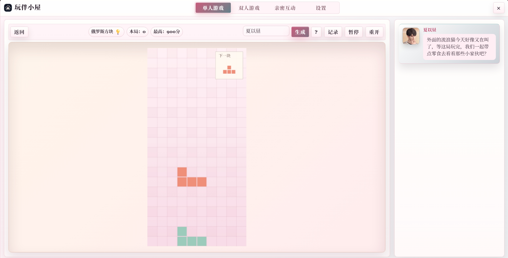
</p>

规则和流程：

1. 方块会从上方不断落下。
2. 你可以左右移动、旋转，也可以主动加速下落。
3. 横向凑满一整行后，该行会消除并得分。
4. 一次消除多行会得到更高分。
5. 顶部可以显示/隐藏键位；隐藏后只保留上下键，棋盘会自动居中并放大。
6. 棋盘会显示本局累计消除行数；方块堆到顶部时游戏结束。

#### 贪吃蛇

<p align="center">
  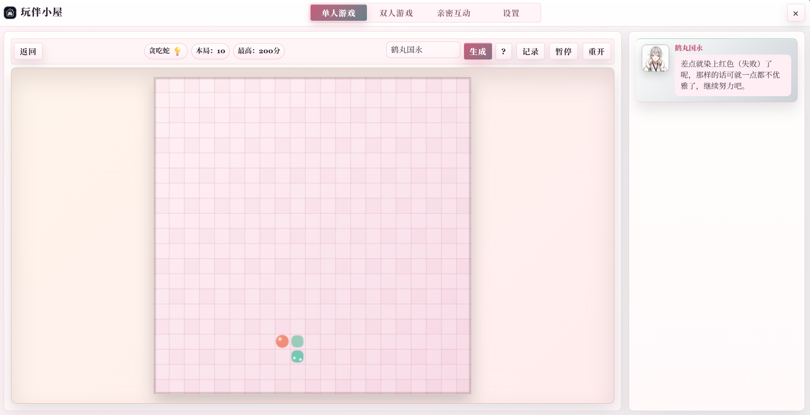
</p>

规则和流程：

1. 控制小蛇上下左右移动。
2. 吃到食物会加分，蛇身也会变长。
3. 分数越高，蛇的速度越快。
4. 顶部可以显示/隐藏键位；隐藏后方向键全部收起，蛇盘会自动居中并放大。
5. 撞墙或撞到自己的身体就会结束。
6. 目标是吃得更多、活得更久。

#### 2048

<p align="center">
  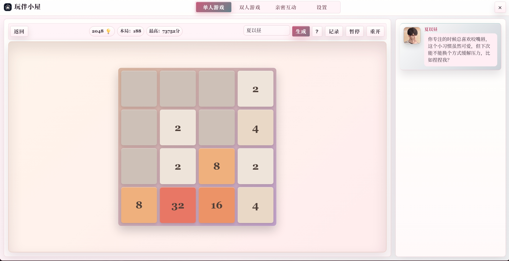
</p>

规则和流程：

1. 开局选择正常版 4×4 或爽玩版 6×6。
2. 上下左右滑动棋盘，相同数字撞到一起会合并成更大的数字。
3. 每移动一次，棋盘会新增一个数字块。
4. 下方有撤回 3 次、消除 2 次；消除可以敲掉一个方块。
5. 爽玩版更容易铺开，最终分数减半。
6. 棋盘被塞满且无法移动时结束；超过 2048 的大数字会触发统一惊讶语录。

#### 合成大西瓜

<p align="center">
  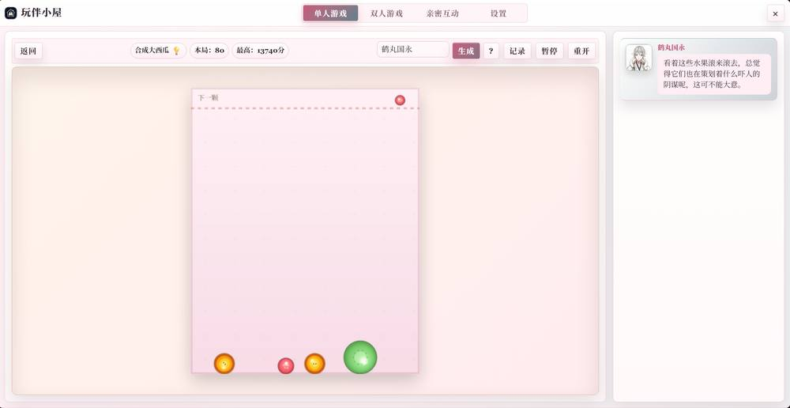
</p>

规则和流程：

1. 选择位置投放水果。
2. 相同水果碰到一起会合成更大的水果。
3. 水果会滚动、挤压、堆叠，落点很重要。
4. 成功合成最终大西瓜会触发特殊语录。
5. 水果堆超过顶部警戒线时结束。

#### 翻牌记忆

<p align="center">
  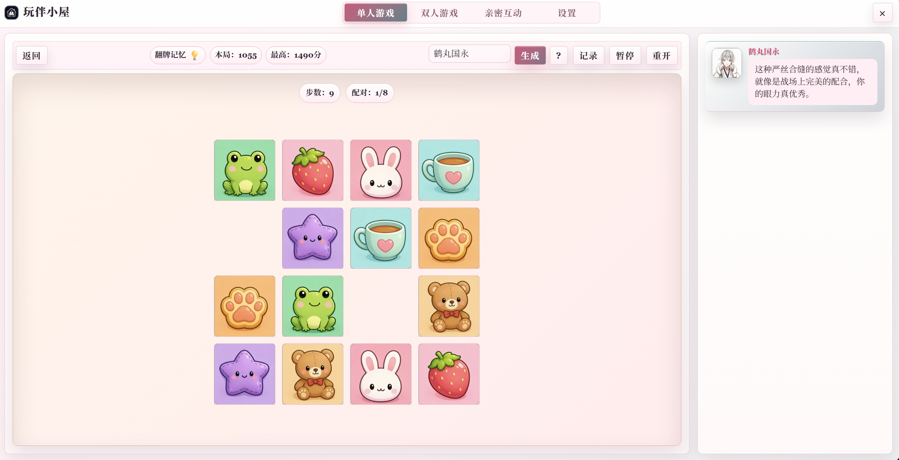
</p>

规则和流程：

1. 牌面初始全部扣住。
2. 每次翻开两张牌。
3. 如果两张图案相同，就会配对成功并保留翻开。
4. 如果不同，会短暂展示后重新扣回去。
5. 全部配对完成后结算，步数越少越好。

#### 跳一跳

<p align="center">
  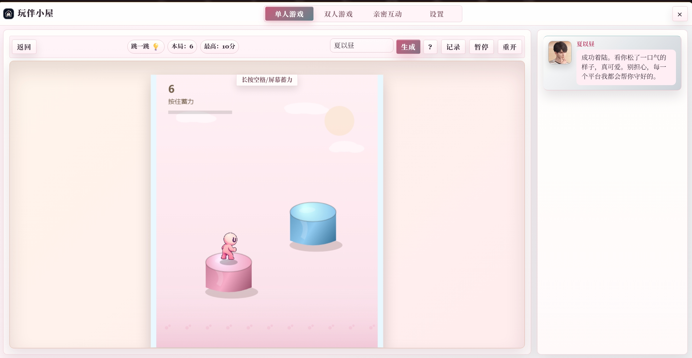
</p>

规则和流程：

1. 按住屏幕或按键开始蓄力。
2. 松开后角色会跳向下一个平台。
3. 蓄力越久，跳得越远。
4. 落到平台上就得分，越接近中心越漂亮。
5. 没落到平台上就会结束。

#### 搭木板

<p align="center">
  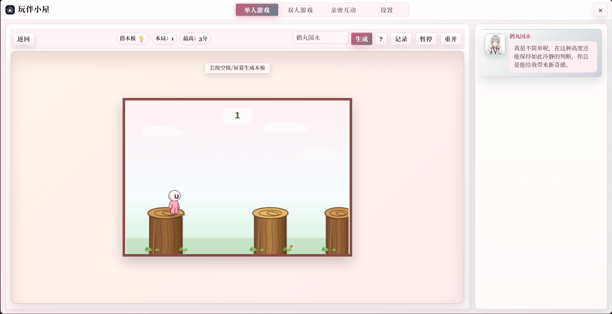
</p>

规则和流程：

1. 长按屏幕或空格生成木板。
2. 松开后木板会倒下，变成通向下一根柱子的桥。
3. 木板太短会够不到，太长会走过头。
4. 刚好搭到柱子中心附近会触发更好的反馈。
5. 角色掉下去时游戏结束。

#### 数独

<p align="center">
  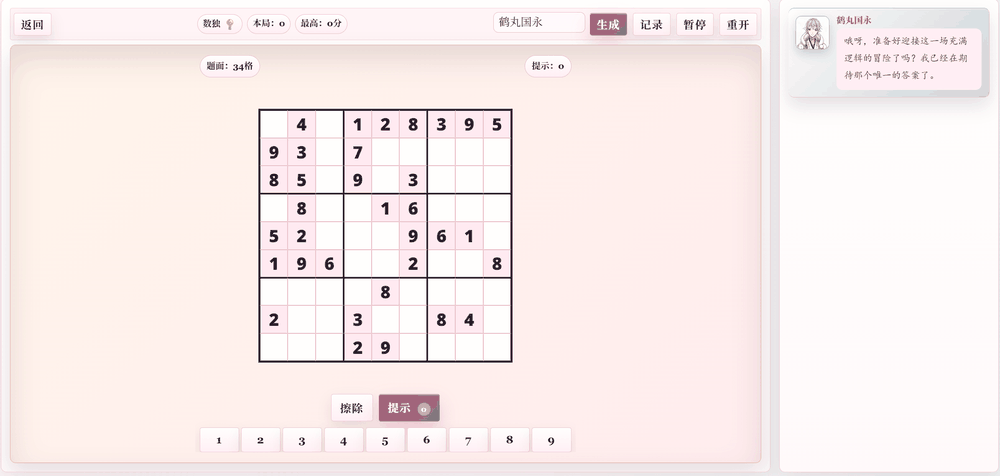
</p>

规则和流程：

1. 每局先选择难度：简单空 30-35 格，中等空 43-48 格，困难空 53-58 格。
2. 点击空格后输入 1-9。
3. 同行、同列、同宫不能出现重复数字。
4. 可以擦除，也可以点击求助。
5. 填满且全部正确后完成；难度会影响最终分数倍率。

#### 舒尔特方格

规则和流程：

1. 每局先选择 4×4、5×5 或 6×6 难度，并可选择「盲点」模式。
2. 点击数字 1 后开始计时，按 1、2、3……一路点到最后一个数字。
3. 普通模式点对后数字会变淡；盲点模式点对后不变色，难度更高并有少量分数加成。
4. 用时显示精确到 0.01 秒，完成越快、连击越高分数越高。
5. 可以使用提示、聚焦和重排道具；点错会扣分并打断连击。

#### U了个U

<p align="center">
  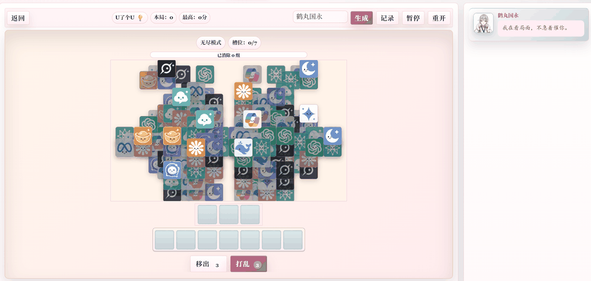
</p>

规则和流程：

1. 每局先选择普通模式或无尽模式；普通模式可通关，无尽模式会在剩余牌较少时自动追加下一批牌层。
2. 点击没有被上层遮挡的牌放入下方槽位。
3. 同图标凑满 3 张会消除。
4. 槽位超过 7 格且没有消除时失败。
5. 无尽模式失败时统计目前已经消除的组数，3 张为 1 组。

#### 无尽蜘蛛纸牌

规则和流程：

1. 每局先选择简单或困难模式；简单模式只使用黑桃一种花色，困难模式保持黑桃与红桃双花色。
2. 卡牌可以按点数递减叠放，只有同花色连续递减的牌组可以整体移动。
3. 同花色 K 到 A 的完整序列会自动收起；牌库可以继续发牌，形成无尽玩法。
4. 发牌后的执行步数会随已完成牌组数量递减；倒计时归零会自动发牌。
5. 存在空列时必须先填满才能发牌；任意牌列超过 30 张会进入危险结算。

#### 拧螺丝

<p align="center">
  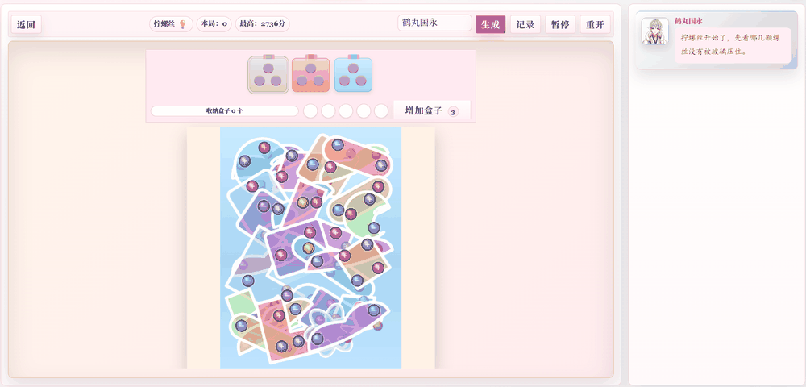
</p>

规则和流程：

1. 每局先选择普通模式或无尽模式；普通模式可通关，无尽模式会在剩余面板/螺丝较少时自动追加下一批，直到失败。
2. 普通模式会生成更多分层面板和螺丝；无尽模式会保留当前未清完的面板、盒子和托盘状态继续补充螺丝和玻璃，失败前没有通关结算。
3. 题面按颜色三倍数生成螺丝，顶部显示随机颜色工具盒。
4. 不匹配当前工具盒的螺丝进入 5 格临时托盘；托盘满 5 格后，再点击一颗无法直接进入工具盒的螺丝时失败。
5. 上层面板会遮挡下层螺丝，只有露出的螺丝可以点击。
6. 面板剩 1 颗螺丝时会以该螺丝为轴摆动；失去全部螺丝后受重力下落。无尽模式只显示已收纳盒子数量，增加盒子仍然最多 3 次。
7. 无尽模式失败时会按当前盒子数量结算倍率：不增加盒子倍率最高，增加到 6 个盒子倍率最低。

#### 消灭星星

<p align="center">
  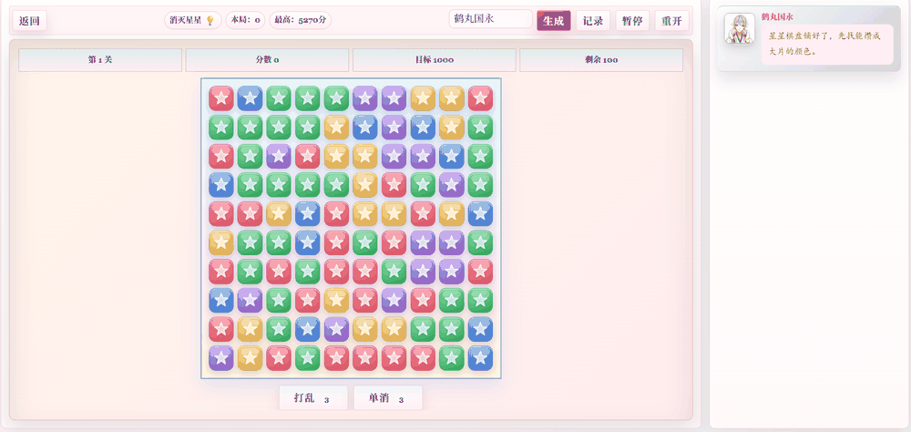
</p>

规则和流程：

1. 使用 10×10 彩色星星棋盘。
2. 点击 2 个及以上上下左右相连的同色星星即可消除。
3. 单次消除得分为「方块数 × 方块数 × 5」；8/12/16 个以上大块会额外奖励 100/300/600 分。
4. 每关有步数限制：25 - floor(关卡 / 3)，最低 20 步；顶栏会显示剩余步数和达标所需的每步均分；消除、打乱、单消都会消耗 1 步。
5. 方块消除后会下落并向左压缩；没有可消除组合或步数用完时进入本关结算。
6. 剩余 0 个奖励 1000 分，剩余 1-5 个奖励 500 分，剩余 6-10 个奖励 200 分；无可消除组合且还有步数时，按剩余步数给少量奖励。
7. 每局有 3 次「打乱」和 3 次「单消」道具；打乱只交换现有星星颜色，不改变当前空洞和方块排布。
8. 分数达到本关目标后会显示达标提示，目标分和顶部分数会变色；结算后达标进入下一关，未达标则游戏结束。
9. 游戏会记录高分消除、连续高分、命悬一线、神之一手和每关剩余方块数量，并用于语录、小剧场和日志。

#### 泡泡龙

规则和流程：

1. 使用交错网格泡泡棋盘，按住或拖动瞄准，松开发射。
2. 泡泡会在左右墙反弹，碰到天花板或已有泡泡后吸附到最近空槽。
3. 3 个及以上同色相连会消除；消除后只要不再连着顶部的泡泡才会悬空掉落。
4. 发射后当前泡泡会立刻切换到下一颗，飞出去的泡泡继续完成碰撞和结算。
5. 顶部下压会保持原棋盘内容原样向下平移，只在最上方新增一行；初始每 10 发下压一次，每下压 2 行后间隔减少 1 发，最低固定为 5 发。
6. 如果场上泡泡只剩 5 个以内，会立刻补压一行，避免清屏后失去压力。
7. 每局有 5 个炸弹；炸弹会消除落点周围泡泡。任意泡泡越过红色警戒线时游戏结束。

#### 祖玛

规则和流程：

1. 青蛙位于轨道中央；按住棋盘进入瞄准，拖动调整方向，松手后向当前方向吐出彩珠。
2. 彩珠碰到移动珠链后会插入落点；连续 3 颗及以上同色珠会触发消除。
3. 消除后两段珠链会重新接合，如果交界处再次凑成同色三消，会继续连锁并获得更高分数。
4. 珠子发射出去后，青蛙口中会立即切换成下一颗的颜色；可手动交换当前珠与下一颗珠。
5. 炸弹清除落点附近最多 5 颗，减速持续 8 秒，彩虹珠会变成命中珠的颜色。
6. 整局只有一条持续运动的珠链，没有关卡或轮次；入口会随珠链前进持续补入新珠子，累计生成后会逐步解锁到最多 6 种颜色。
7. 消除时同色珠会先膨胀、爆裂并淡出，然后前方珠链平滑回退；回退接合后如果再次凑成同色三消，会继续播放爆裂和回退连锁。
8. 清空整条珠链奖励 600 分，随后入口会继续产生新珠子；珠链数量较少时会适当减速，速度也会随分数、累计消除数和珠链数量动态变化，最高封顶 84。珠链头部进入终点洞口时游戏结束。

#### 倒瓶子

规则和流程：

1. 点击一个非空瓶子选中水源，再点击目标瓶，会一次倒出源瓶顶部连续的同色水层。
2. 目标瓶必须为空，或者顶部与倒出的水同色；每瓶最多容纳 4 层水。
3. 无法倒水时瓶子会显示错误反馈，再次点击已选中的瓶子可取消选择。
4. 所有非空瓶都变成装满 4 层的纯色瓶即可进入下一关；关卡无限生成，不再于第 12 关结束。
5. 颜色从 3 种逐步增加到最多 10 种，第 9 关起初始空瓶由 2 只减为 1 只，反向打乱深度也会逐步提高。
6. 题面从已完成状态反向打乱，并保存可按标准规则执行的逆序解，因此每关都可解；难度参数封顶后仍会继续生成不同题面。
7. 初始有 5 次撤回、3 次提示和 1 个额外空瓶；撤回每关补 1 次，提示每 2 关补 1 次，额外空瓶每 5 关补 1 次，也可随时重置或结算本局。
8. 未使用提示、撤回、额外空瓶或重置完成当前关，会获得完美奖励。

#### 连连看

规则和流程：

1. 点击两个相同图案，如果它们能用最多两次转弯的横竖路径连起来，就会成对消除。
2. 连接线可以从棋盘外侧一格绕行，但不能穿过其他图块或石块。
3. 共 12 关，后续关卡会加入下落、上移、左右靠拢、集中、分散和石块障碍。
4. 每关有提示、洗牌、冻结和魔法消除道具；道具数量每关重置。
5. 清空棋盘并达到目标分会自动进入下一关，完成第 12 关显示完整通关结算。

#### 1010!

规则和流程：

1. 使用 10×10 方块棋盘，拖动底部 3 个候补方块放入棋盘。
2. 方块不可旋转；任意行或列填满后会立即消除并得分。
3. 3 个候补方块全部放完后会刷新新一批。
4. 每局有 3 次「重新生成」和 3 次「小锤子」；重新生成会换掉当前候补方块，小锤子可以敲掉一个已有格子。
5. 当剩余候补方块无法放入棋盘，且道具也用完时游戏结束。
6. 倒霉小剧场只会在“本轮使用过重新生成或小锤子救场，但仍然没能继续放置并失败”时触发。

### 双人游戏

双人游戏会让你和 char 轮流行动。语录更偏互动，会根据胜负、堵路、抽牌、危险局面等事件变化。

支持耍赖模式的双人游戏，每局最多可以成功 3 次「耍赖」撤销上一步操作。每轮只能尝试一次耍赖；成功率 50%，成功会扣除 1 次并触发纵容撤回语录，失败不会扣次数，会显示类似飞行棋不能行动的顶部提示并触发拒绝撤回语录。如果三次都用完还能获胜，会触发耍赖小剧场。

#### 21点

规则和流程：

1. 每一小局重新洗一副完整 52 张牌，先猜红黑抽一张判定牌决定本局先手；猜中你先行动，猜错则当前陪伴角色先行动。
2. 玩家和 char 从同一个牌堆依次抽牌，轮到自己时可选择「要牌」或「停牌」，A 会自动按最有利的 1 点或 11 点计算。
3. 开局 A+10 点牌为 Blackjack，高于普通 21 点；爆牌会立即输掉本轮。
4. 共 8 关，每关双方积分从 0 开始竞速，谁先达到目标积分谁赢下本关。
5. Char 会随关卡提升从点数判断进化到概率推演，但不会偷看下一张牌。
6. 每关重置提示、偷看、反悔、护牌道具；挑战失败时有 5 次免费复活机会，可重开当前关或认输结算。
7. 完成第 8 关会显示完整通关结算。

#### 双人飞行棋

<p align="center">
  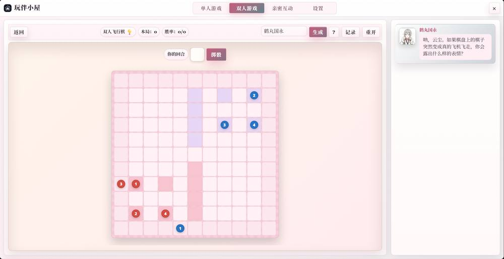
</p>

规则和流程：

1. 开局会决定谁先手。
2. 掷到 6 点可以让停机坪里的棋子起飞。
3. 棋子按骰子点数沿路线前进。
4. 落到飞行区时会直接飞行：12 -> 20 会显示虚线航线，22 -> 30 与等待区重合所以只标出飞行格颜色；user 和 char 各有两条对应飞行区。
5. 落到对方棋子所在格时，可以把对方撞回家。
6. 四枚棋子全部到达终点的一方获胜。

#### 猜数字

<p align="center">
  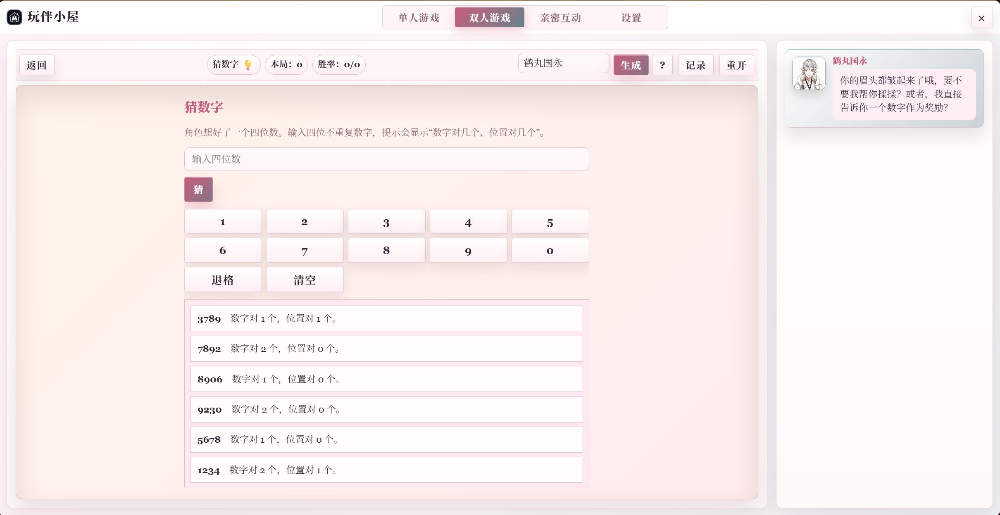
</p>

规则和流程：

1. char 会想好一个四位不重复数字。
2. 你每次输入一个四位不重复数字。
3. 系统会提示「数字对几个、位置对几个」。
4. 数字对表示猜中了某个数字，位置对表示数字和位置都对。
5. 猜出完整顺序就获胜。

#### 我说你猜

<p align="center">
  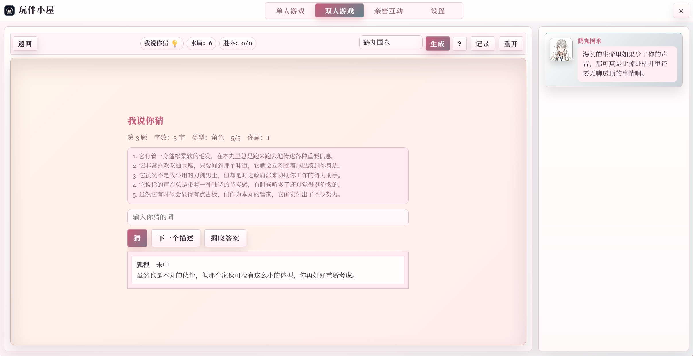
</p>

规则和流程：

1. char 会给出一个词语题目。
2. 每题最多有多条描述，可以逐条解锁。
3. 你可以随时输入答案。
4. 猜不中时会保留猜测记录，也可以继续看下一条描述。
5. 一局多题，猜中题数更多就算赢。

提示：这个游戏支持为当前角色生成专属题库。没有生成时会先使用默认题库。

#### 井字棋

<p align="center">
  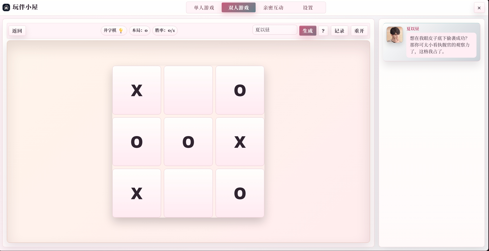
</p>

规则和流程：

1. 开局会决定谁先手。
2. 你和 char 在 3×3 棋盘里轮流落子。
3. 横、竖、斜任意方向先连成三格就获胜。
4. 棋盘下满但无人连线则平局。
5. 中心格、角落格、最后一步获胜等局面会触发不同互动。

#### 五子棋

<p align="center">
  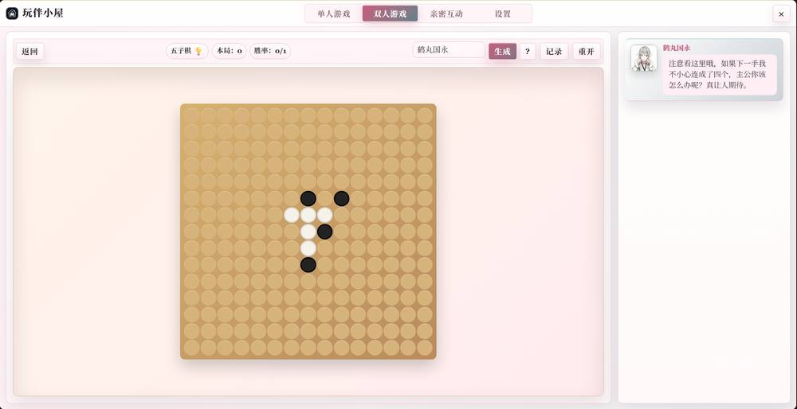
</p>

规则和流程：

1. 开局先选择普通模式或无尽模式，再决定谁先手。
2. 普通模式中，横、竖、斜任意方向先连成五子的一方获胜。
3. 无尽模式双方各 30 颗棋子，连五后回收自己的五子。
4. 回收后可吃掉对方一颗棋子，并用自己的棋子替换该位置；若再次连五可继续回收和吃子。
5. 一方棋子被吃完会输；双方都无可用棋子时，吃子更多的一方获胜。

#### 电子围地盘

<p align="center">
  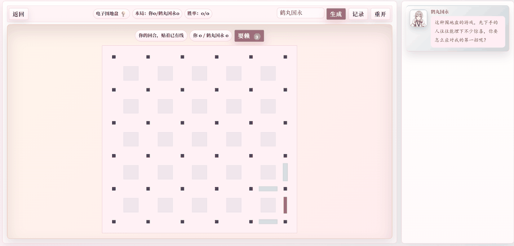
</p>

规则和流程：

1. 双方轮流在点阵之间画边。
2. 谁画下一个小方格的第 4 条边，谁就占领该格。
3. 占领方格后可以继续行动。
4. 后期没有安全边时，每一步都可能给对方送分。
5. 所有边画完后，占领格子更多的一方获胜。

#### 抽鬼牌

<p align="center">
  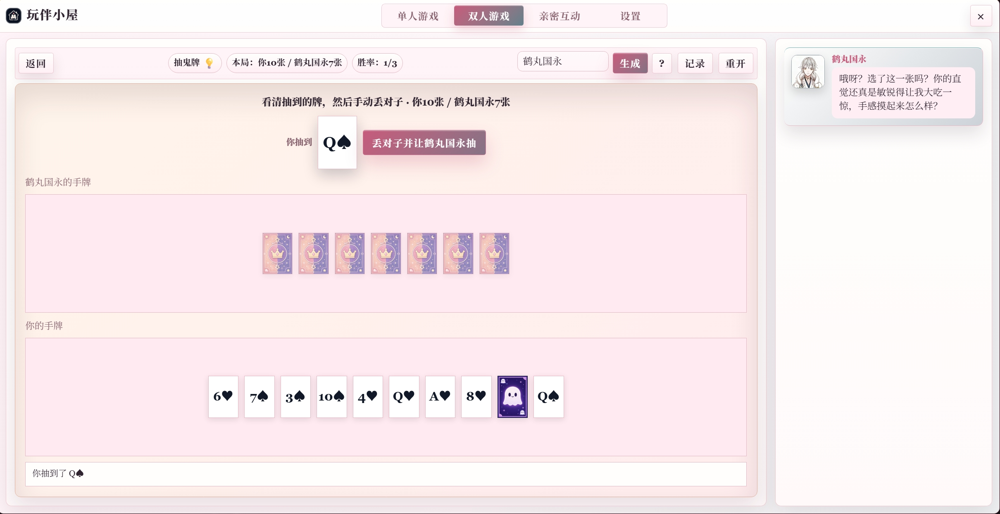
</p>

规则和流程：

1. 双方初始获得一组手牌，其中包含一张鬼牌。
2. 开局会自动消去已有对子。
3. 你从 char 手牌里抽一张，char 再从你手牌里抽一张。
4. 抽到能配对的牌就会消去。
5. 最后谁手里留下鬼牌，谁就输了。

#### 翻转棋

<p align="center">
  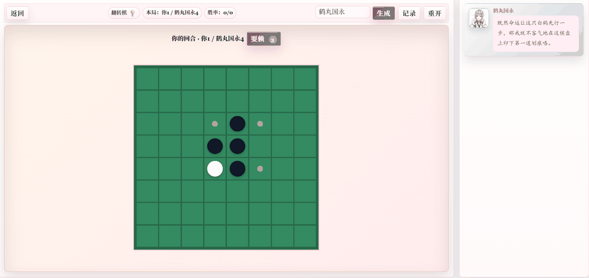
</p>

规则和流程：

1. 使用 8×8 棋盘，双方轮流落子。
2. 新棋子和己方棋子夹住的对方棋子会被翻转。
3. 没有合法落子时会跳过本回合。
4. 角落非常重要，大量翻子也会触发特殊反馈。
5. 棋局结束后，棋子数量更多的一方获胜。

#### 数字炸弹

<p align="center">
  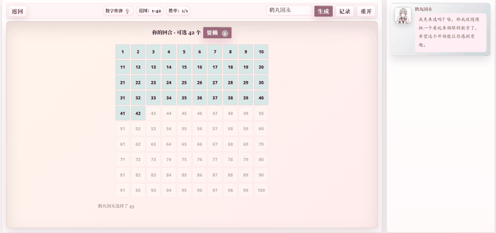
</p>

规则和流程：

1. 1-100 中会藏着一个炸弹数字。
2. 双方轮流点击当前范围内的数字。
3. 点到安全数字后，可选范围会缩小。
4. 点到炸弹数字的人失败。
5. 范围越小越紧张，最后只剩一个选择时很有节目效果。

#### 立体四子棋

<p align="center">
  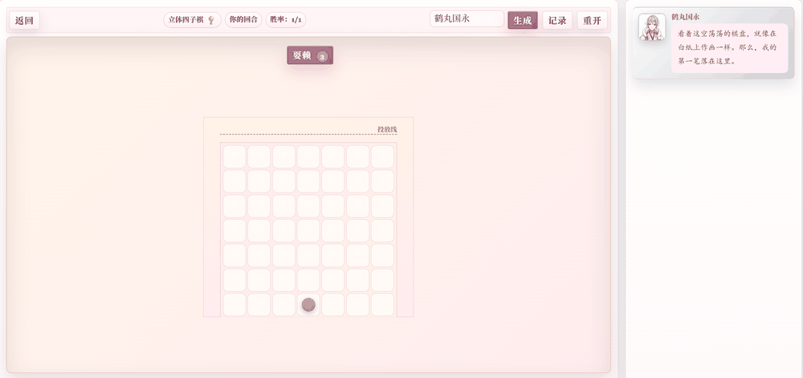
</p>

规则和流程：

1. 双方轮流在 7×7 棋盘上选择横向位置投放棋子。
2. 棋子会从上方落到该列最低的空位。
3. 横向、纵向或斜向连成四个同色棋子即可获胜。
4. 三连、堵路、即将四连都会触发互动。
5. 棋盘填满且无人连成四子则平局。

#### 跳棋

<p align="center">
  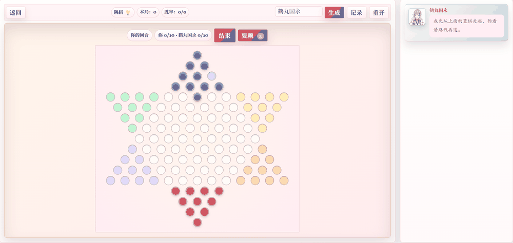
</p>

规则和流程：

1. 开局先选择傻瓜模式或大师模式，再决定谁先手。
2. 你在下方红色营地，char 在上方蓝色营地。
3. 每回合可以走到相邻空位，也可以沿横线或 60° 斜线隔棋镜像跳跃。
4. 傻瓜模式会直接高亮每颗棋能到达的最终落点；大师模式会逐步高亮下一步落点，连续跳跃后需要点击「结束」完成回合。
5. 被跳过的棋子可以是自己或对方；连续跳跃时会一步一步动画展示。
6. char 会综合进营、守营、距离、对手反击和重复路线来选择棋步，避免最后几个棋子反复走无效远跳。
7. 先让 10 颗棋子全部进入对方营地的一方获胜。

#### 国际象棋

规则和流程：

1. 使用标准 8×8 棋盘，你执白棋先手，char 执黑棋后手。
2. 点击自己的棋子会高亮所有合法落点，再点击合法格完成移动或吃子。
3. 棋盘保留双方最近一步：青绿色是你的移动，金色是 char 的移动；起点阴影较浅，终点带边框。
4. char 吃掉的白棋显示在棋盘上方，你吃掉的黑棋显示在棋盘下方。
5. 已实现将军、将死、逼和、王车易位和兵到底线自动升变为后；不使用吃过路兵。
6. 顶部只有「反悔」按钮，没有下方其他道具按钮；反悔会同时恢复移动标记和吃子栏。
7. 将死对方获胜；逼和、50 回合无吃子无兵动或三次重复局面会判平。

#### 中国象棋

规则和流程：

1. 使用标准 9×10 棋盘，你执红棋先手，char 执黑棋后手。
2. 点击自己的棋子会高亮合法落点，再点击合法格完成移动或吃子。
3. 棋盘用圆形标记保留双方最近一步：青绿色是你的移动，金色是 char 的移动；起点为较淡虚线圆，终点为实线圆。
4. char 吃掉的红棋显示在棋盘上方，你吃掉的黑棋显示在棋盘下方。
5. 已实现车、马、相/象、仕/士、帅/将、炮、兵/卒的基础规则，包含马腿、象眼、九宫、过河兵、炮架和将帅照面限制。
6. 顶部只有「反悔」按钮，没有下方其他道具按钮；反悔会同时恢复移动标记和吃子栏。
7. 将死对方获胜；轮到一方无合法走法会按将死或困毙结算，长回合未吃子会判平。

### 亲密互动

<p align="center">
  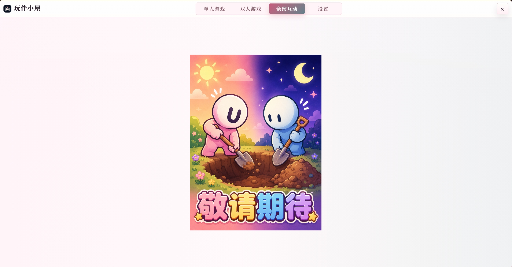
</p>

亲密互动是长期陪伴内容的入口，目前重点模块是「灵息小窝」。

当前包含：

- 灵息小窝：和当前角色共同领养、照顾、记录一只灵息宠物。
- 试用版：直接读取本地宠物文本，用于体验或调试。
- 桌宠模式：宠物可以离开小屋，陪你停留在插件页面。
- 真心话大冒险 / 一起种田：仍在规划中。

## 灵息小窝养宠模块

灵息世界，是一个有着不同能力动物的地方。他们会在你的世界里散落不同能力的宠物蛋，选择自己心意的主人，互相陪伴到长大。

在你的世界里，你可以选择他们是否成为灵息宠物，还是和你一起做平凡的小动物过完一生。它会在你和 char 的陪伴下，拥有属于彼此的难忘回忆。

你只需要选择和你一起抚养灵息宠物的饲养员，选择一枚自己心仪的蛋，就可以获得一整套和 char 一起养宠物的故事。当然，如果想随意体验一下，也可以先尝试试用体验版（但试用版是我随便捏的普通 char 和 u，跑出来的剧情可能比较一般……就当是体验不同的小宠物吧！）

目前的抚养系统比较简单，主要以剧情和桌宠为主，也可以记录每一天的养宠日志。总之，如果有 bug 可以戳我，我有时间就努力修。如果反响足够好，下一个会继续推出真心话大冒险：如果 char 去做你想让他做的大冒险，或者你想问一些主线里没说出口的问题，会是什么反应呢？

下面是简单的小教程：

- 主页顶栏「char 的小屋」旁边的下拉按钮，可以进入选择饲养员界面。
- 点击右上角 `+`，选择你在设置里添加过的 char。如果没有，请先去设置里添加该角色世界观，并添加 API 预设。
- 进入角色后填写领养登记表。一般选择蛋和名字就够了；如果想开挂选择宠物，或者自定义想要的超能力宠物，可以进入许愿模式。
- 推荐试用模型 3.1 pro。本次输入 token 大约 1-3w，输出 token 大约 2-3w，算是比较复杂的生成了（但是一次生成就可以玩一整套养宠游戏）。建议用稳定一点的 API，生成过程会比较慢，请耐心等候。
- 弹出宠物名片后，满意的话就进入游戏吧！主要玩法是：过剧情、玩游戏增加成长值、把宠物放出来当桌宠、和 char 体验更有趣的带宠生活。

### 进入与饲养员

1. 在「亲密互动」里点击「灵息小窝」。
2. 如果你已经进入过某个角色的宠物页面，下次会自动回到该宠物页面。
3. 如果没有正在养的宠物，会进入「选择饲养员」。
4. 「试用版」会读取本地角色数据，适合快速体验。
5. 正式模式可以点击右上角 `+`，从当前世界观里添加角色作为饲养员。每个角色的宠物、日志、剧情和日期记录互相独立。
6. 如果某个角色还没有宠物，会进入「领养登记表」。如果已经有宠物，点击该角色会直接进入对应小屋。

### 领养登记表

正式模式会用 AI 生成完整宠物文案。登记表包含：

- `{{user}} 名字`：用于写入宠物文案、日志和名片。
- `选择你想要的蛋`：可选蓝色、紫色、粉色、绿色、金色、白色蛋。
- `养宠次数`：自动填写该角色已经养过多少只宠物。第二只开始，生成输入会包含之前宠物的日志和剧情回忆。
- `许愿模式`：开启后可以指定品种、性别、灵息能力；每项也可以选择随机。
- `宠物姓名`：不知道性别时需要填写男孩名和女孩名；如果许愿指定了性别，只需要对应名字。
- `模型选择`：选择你在设置里保存好的 API 预设。
- `模型生成次数`：如果解析失败，会在次数范围内自动重新生成。

生成时会组合 `world.txt`、当前角色世界观、登记表输入和 `info.txt`。界面下方会流式显示 AI 正在生成的内容，生成并解析成功后会显示蛋形态名片。

### 宠物阶段

- 蛋形态：只有成长值。主要通过抚摸、戳戳、写日志和记录来陪伴；成长值到 100 会触发破壳。
- 幼年期：破壳后出现动物本体，开始有饱食度和开心值，可以喂食、抚摸、遛弯。
- 成年期：继续通过互动和剧情推进成长，宠物会更频繁地参与生活。
- 灵息 / 普通路线：后期剧情会让宠物做出选择，成为真正的灵息宠物，或保留更普通、更日常的动物生活。
- 旅程结束：最终剧情完成后，小屋中间会空出来，右侧按钮隐藏，上方出现「领养新的宠物」。

### 主页面说明

<p align="center">
  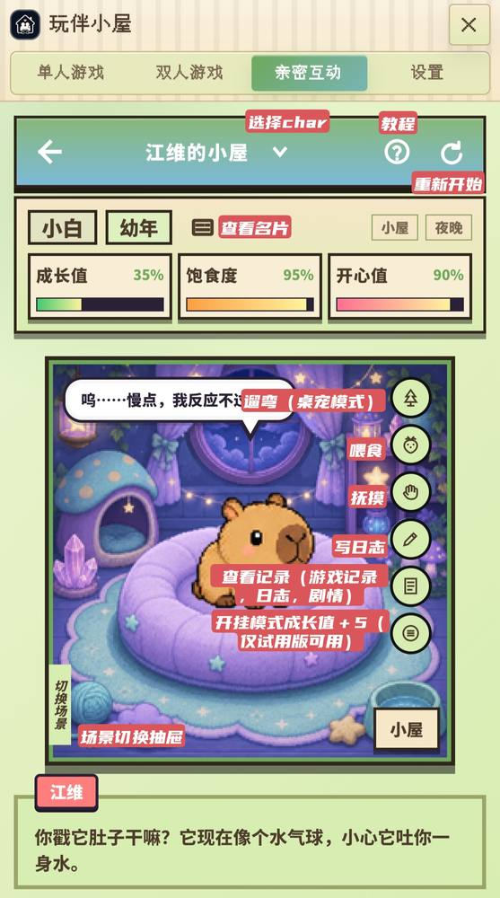
</p>

图片大概标出了小屋页面的主要按钮。按钮不复杂，剩下的小细节也可以自己挖掘一下~

- 顶栏：返回、教程、重开，以及中间的「角色的小屋」。标题旁边的小三角可以切换饲养员。
- 状态栏：显示宠物名称、阶段、当前场景、时间和名片按钮。名片会展示品种、姓名、蛋、性别、性格、灵息、收养人和第几只宠物。未解锁的信息会显示 `???`。
- 进度条：成长值推动阶段和主线；饱食度通过喂食恢复；开心值通过抚摸、游戏等恢复。蛋形态只显示成长值。
- 场景：小屋、小院、花园会随阶段解锁。未解锁场景会有锁，点击会提示继续养宠。
- 宠物对话云朵：宠物有语录时才会显示；没有内容时不会占位。
- 底部对话框：平时显示角色语录；剧情中显示 RPG 对话。剧情文字会按真实两行高度分页，点击任意位置继续。

### 右侧按钮

- 遛弯：确认后进入桌宠模式。桌宠开启期间每生成 3 次 RP 正文增加 1 点成长值，挂机不会增加。
- 喂食：增加饱食度；饱食度确实增加时也会增加成长值，并可能触发支线事件。
- 抚摸：增加开心值；开心值确实增加时也会增加成长值。蛋形态抚摸每 10 分钟可增加成长。
- 写日志：打开手账式日志生成页。AI 会结合宠物名片、当天互动、当天剧情和你补充的内容生成日志。
- 记录：查看日期记录、日志记录、剧情记录。
- 开挂模式：试用/调试按钮，点击增加 5 点成长值，方便测试剧情。

### 剧情系统

- 主线剧情通常由阶段和成长值触发，例如确认灵息蛋、破壳、幼年成长、成年选择、结局。
- 支线剧情可由喂食、抚摸、遛弯、玩游戏、时间、地点、次数或概率触发。多和宠物互动，多带宠物逛一逛场景，会更容易触发支线剧情。
- 剧情触发时会先出现小弹窗，显示主线/支线、剧情名和简介。可以进入剧情，也可以放弃；放弃也会存档。
- 剧情模式中会隐藏右侧交互和场景切换按钮，上方显示「剧情模式中」。
- 剧情记录里可以查看已完成剧情，也可以点击放映机按钮回放。

### 日志与记录

- 写日志：生成当天宠物日记，包含日期、宠物名称、宠物形态、标签、我们的关系、特别记忆存档、标题和正文。
- 保存规则：同一天已有日志时，再保存会提示是否覆盖。
- 日期记录：日历会根据当天累计成长值显示颜色；50 以上颜色最明显。下方记录喂食、抚摸、遛弯、游戏等加分标签。
- 日志记录：按日期和具体时间列出日志，点击后使用同样的手账版式展示。
- 剧情记录：按日期和具体时间列出剧情，区分主线/支线，显示基础信息、标题、summary、正文和角色姓名卡片。
- 多宠物记录：同一个角色历史养过的所有宠物都会在该角色记录中保留。

### 桌宠模式

<p align="center">
  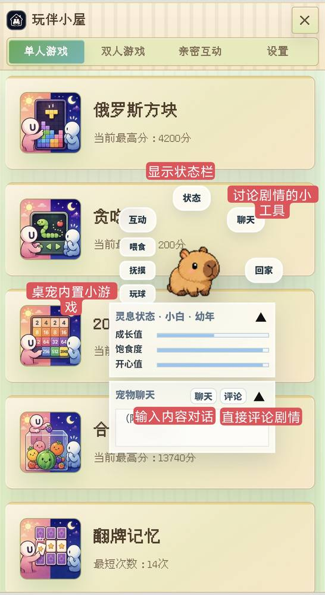
</p>

桌宠是我最喜欢的小功能：可以一边玩酒馆，一边玩小游戏，一边逗你的小宠物。谁不想让一只萌萌的小动物出现在酒馆页面呢~

- 开启：点击「遛弯」并确认后，宠物会离开小屋成为桌宠。
- 正文成长：桌宠开启期间每生成 3 次 RP 正文增加 1 点成长值，不按在线时长结算。
- 拖动：无论状态栏或聊天框是否打开，都可以拖动宠物移动。
- 戳一戳：点击宠物会展开扇形按钮：互动、状态、聊天、回家。
- 互动：包含喂食、抚摸、顶球。顶球超过 5 次可增加成长值。
- 状态：显示宠物名、灵息状态、成长/饱食/开心进度。
- 聊天：宠物会以旁观者/读者身份评论最近剧情，也可以回应你的聊天。可以试着让它一起看当前酒馆剧情。
- 回家：返回养宠页面并关闭桌宠。

## 陪伴系统

### 角色语录

角色语录会根据游戏事件触发。

单人游戏里，char 更像坐在旁边看你玩，会在开局、得分、失误、危险、破纪录、结束时碎碎念。

双人游戏里，char 会参与对局，所以语录更偏互动。比如飞行棋撞回家、五子棋堵棋、抽鬼牌抽到鬼牌、数字炸弹范围变窄，都可能有不同反应。

### 小剧场

游戏结束后，小剧场有概率触发。

普通结算会按胜负、分数生成互动。特殊事件会触发特殊小剧场，比如破纪录、连赢三场、连输三场、惜败、险胜、超级厉害、超级菜、命中注定、气急败坏等。

### 游戏日志

完成一场游戏后，角色可以记录一条日志。

日志可以在每个游戏右上角的「记录」里查看。你也可以选择手动点「生成日志」，或者在设置里打开「自动记录日志」。

### char 的记忆

char 的语录和日志可以结合这些内容定制：

- user 信息
- char 信息
- 当前角色卡描述
- 世界书条目
- 大总结
- 前几次同角色同游戏日志

每个游戏会读取最近 5 次同角色同游戏日志。如果你有生成日志，char 后续就会像真的记得之前一起玩过一样。

## 快速上手攻略

### 只想当小游戏插件

不想和 char 互动，只想打开玩小游戏的话：

1. 进入「设置」。
2. 关闭「开启陪伴模式」。
3. 直接返回单人游戏或双人游戏开玩。

这样就不会生成语录、小剧场和日志，使用起来更轻。

### 保留上一次窗口

打开「保留上一次窗口」后：

1. 玩到一半关闭玩伴小屋。
2. 下次再打开，会回到上一次所在的游戏界面。
3. 如果该游戏有未结束进度，会提示你继续上次或重新开始。

### RP 正文完成提醒

打开「RP正文完成提醒」后，酒馆正文生成结束时会弹窗提醒你回去看文。

你还可以设置正文标签，例如：

```text
<content>正文内容</content>
```

这样每次弹窗会优先展示标签里的正文内容，方便先瞄一眼生成了什么。

### 完整陪伴流程

推荐流程：

1. 进入「设置」，开启「陪伴模式」。
2. 建议开启「小剧场」。
3. 日志可以手动生成，也可以打开「自动记录日志」。

<p align="center">
  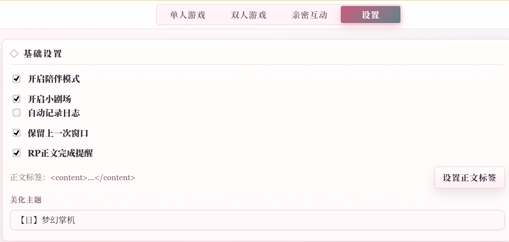
</p>

4. 设置 API。常用 API 建议选便宜好用的 flash 类模型，语录和日志一般够用了。
5. 进入「世界观注入」，先确认当前角色卡。
6. 填写或导入 user 信息。
7. char 信息默认会读取当前角色卡角色描述，也可以手动添加。
8. 可选：保存头像、选择世界书、导入大总结。
9. 全部设置好后，点击「保存为当前角色卡配置」。
10. 下次进入其他角色卡，也可以载入对应角色信息。

<p align="center">
  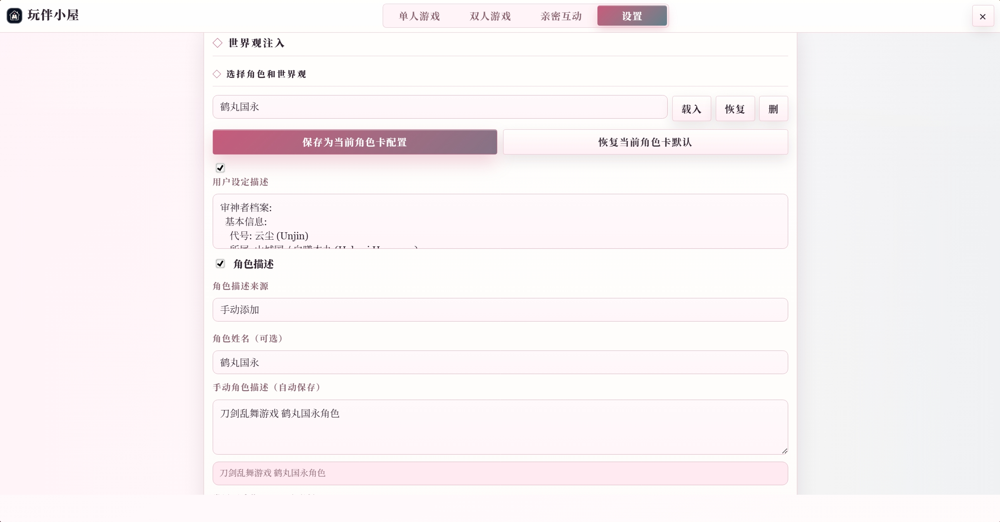
</p>

### 角色切换

玩伴小屋会优先读取当前 SillyTavern 的角色卡。当前角色卡决定默认的角色名称、头像和角色描述；如果你在「选择角色和世界观」里保存过同名角色配置，插件会把该角色对应的世界观、头像、语录和小剧场一起作为可载入内容。

推荐理解成三层关系：

1. 当前角色卡：默认来源。你切换酒馆里的角色卡后，玩伴小屋会把这个角色当作默认陪伴者。
2. 保存的角色配置：角色卡的扩展档案。它可以保存 user 信息、char 信息、头像、世界书、大总结、语录和小剧场等内容。
3. 临时选择角色：本次生成或本局游戏的优先选择。只要你在批量生成或游戏内选择了另一个角色，就会优先使用这个角色的整套内容。

批量生成时可以换角色：

1. 进入「设置」。
2. 在「游戏语录设置」里点击「批量生成角色数据」。
3. 在弹窗顶部选择要生成的角色。
4. 生成时会按这个角色的名称、描述、头像、世界观和已有日志来写语录/小剧场，不会继续沿用主界面当前角色的 user/char 信息。

进入游戏时也可以换角色：

1. 进入某个游戏。
2. 在游戏界面的角色/语录选择处切换角色。
3. 切换后，本局会优先使用该角色的语录、小剧场、头像、名称和世界观。
4. 如果本局里又选择了另一个角色，以游戏内选择为准；如果批量生成时选择了另一个角色，以批量弹窗里的选择为准。

### 预生成角色数据

建议提前把内容生成好，再开始玩。

推荐方式：

1. 进入「设置」。
2. 在「游戏语录设置」里点击「批量生成角色数据」。
3. 选择想玩的游戏。
4. 选择要生成「语录」还是「小剧场」，也可以一起生成。
5. 点击生成并覆盖。

<p align="center">
  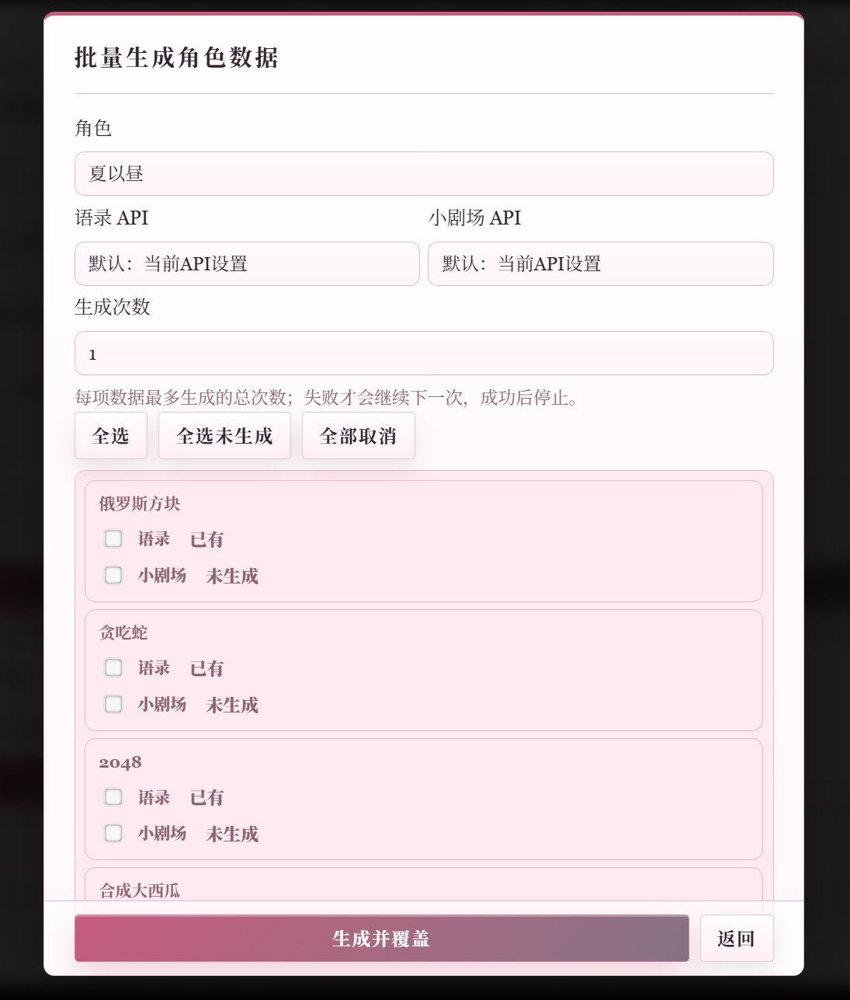
</p>

也可以进入某个游戏后，点击游戏界面的「生成」按钮。这个入口不能单独设置 API，会使用主 API 配置生成。

<p align="center">
  
</p>

游戏结束后的「生成日志」按钮需要手动点击才会生成，除非你已经开启「自动记录日志」。生成后的日志可以在「记录」里查看。

<p align="center">
  
</p>

生成的小剧场可以保存，记录里会保存记录好的日志和小剧场。

<p align="center">
  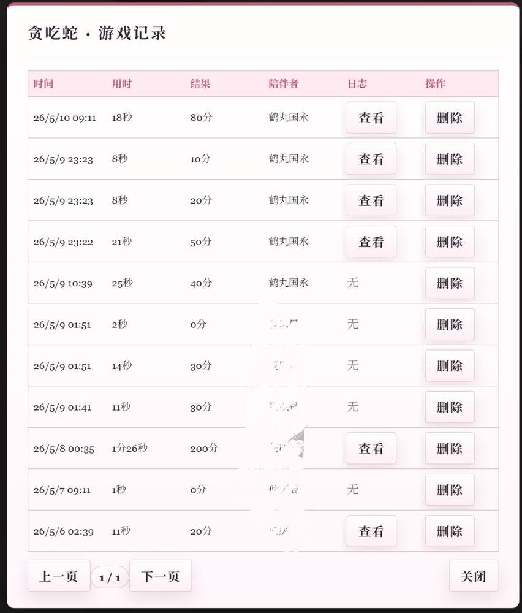
</p>

<p align="center">
  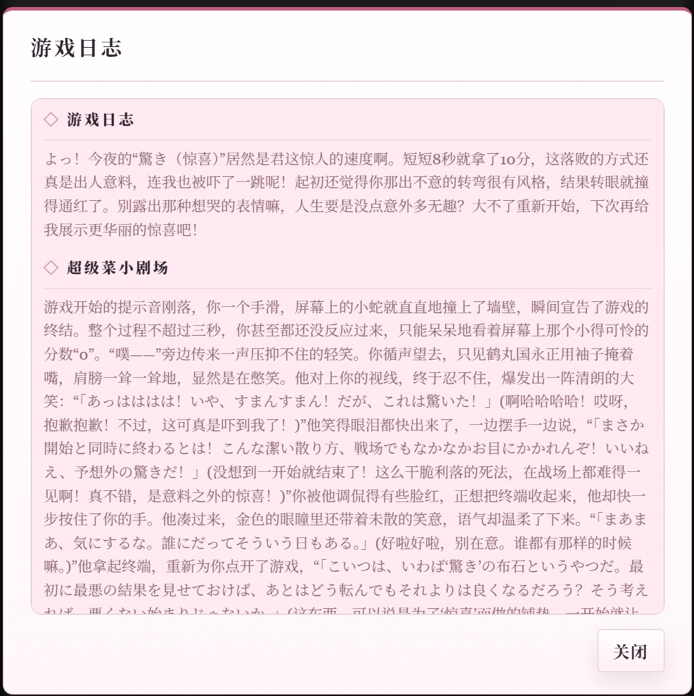
</p>

### 游戏界面帮助

<p align="center">
  
</p>

游戏界面常用按钮：

- 「返回」：回到游戏列表。
- 「💡」：查看当前游戏规则。
- 「生成」：为当前游戏生成角色语录和小剧场。
- 「记录」：查看历史记录和游戏日志。
- 「暂停」：暂停当前游戏。
- 「重开」：重新开始当前游戏。

## 常见问题

### 每个游戏都要消耗 API 吗？

如果开启陪伴并使用生成内容，是的。每款游戏通常至少会消耗 2 类内容：语录生成和小剧场生成。
不过它们是预生成的，一次会生成多条语录/小剧场，可以反复玩几次。看腻了再重 roll 就好。

### 推荐什么模型？

目前测试下来，语录用 Gemini 3 Flash 这类 flash 模型就可以。
小剧场如果想要更细腻的体验，可以试 Gemini 3.1 Pro / 2.5 Pro 这类更强的模型。但因为消耗次数比较多，flash 也完全能用。
日志也推荐用flash，因为每次单独生成，flash又快又省。

### 失败或截断怎么办？

目前没有特别好的办法，可能就是模型抽风或输出被截断了。
可以重 roll，批量生成界面里有「一键选择失败和没有选择的」这类操作，用起来会方便一点。

### 为什么我的 char 在这里很黏人？

因为默认提示词会偏向二人亲密关系的互动。
如果不想要这种感觉，可以在「批量生成角色数据」里修改语录提示词，让它更日常、更冷淡、更朋友向，或者更符合你的角色关系。

### 小剧场可以用自己的文风或预设吗？

可以。
在「批量生成角色数据」里可以修改小剧场提示词。想要固定文风、称呼、叙事习惯、互动尺度，都可以写进去。

### 多久更新一次语录/小剧场比较合适？

目前语录每次触发都是8条，小剧场每个3条，大概可以玩10次左右。如果你玩某个游戏觉得内容看腻了，就可以选择重roll啦。

### 字体/排版有问题？按钮长得很奇怪？

大部分原因都是酒馆美化的CSS作用到插件上啦，建议换一个美化使用。另外我的手机没有问题，但是有部分人的手机上面刘海屏幕的时间那个部分会和这个插件的插。

### 我还想要 XXX 功能？

欢迎来社区许愿。
想要更多夸夸、更多小游戏、更多亲密互动、更多长期养成，都可以说~
受欢迎的话会继续开发www


## 更新日志

### 2026.8.27 V3.7.0

- 新增：单人游戏「祖玛」。
- 新增：单人游戏「倒瓶子」。

### 2026.8.26 V3.6.3

- 优化：宠物遛弯改为每生成 3 次 RP 正文增加 1 点成长值，支持消息去重与进度存档，挂机不再增长。
- 优化：无尽蜘蛛纸牌新增「简单」和「困难」模式；简单模式使用单花色黑桃。
- 优化：国际象棋和中国象棋新增双方最近走子标记与吃子展示。
- 优化：中国象棋移除 char 落子前的固定思考等待。

### 2026.8.18 V3.6.2

- 优化：数独支持继续上次进度。
- 优化：消灭星星新增简单/困难模式。
- 优化：连连看新增连击加时长。
- 优化：蜘蛛纸牌发牌步数规则。

### 2026.8.17 V3.6.0

- 新增：双人游戏「国际象棋」。
- 新增：双人游戏「中国象棋」。
- 优化：「21点」新增 5 次免费复活机会，每小局改为猜红黑抽判定牌决定先手算。
- 优化：「舒尔特方格」用时显示精确到 0.01 秒，并新增点对后不变色的「盲点」模式。

### 2026.8.14 V3.5.1

- 新增：单人游戏「舒尔特方格」。
- 优化：「消灭星星」「连连看」各新增 5 次免费复活机会，失败时可确认复活或认输结算。
- 优化：无尽蜘蛛纸牌恢复按已完成牌组数递减的步数限制。
- 修复：PC 端桌面宠物弹出成长值增加提示后，进入宠物页面成长值可能未实际保存的问题。
- 优化：宠物剧情生成提示词新增普通/灵息立绘颜色硬性规则，避免剧情外观颜色与立绘不一致。

### 2026.8.10 V3.4.3

- 修复：角色切换时默认头像会同步到对应角色。
- 修复：21点和连连看的显示小bug。
- 优化：贪吃蛇、俄罗斯方块、2048 新增移动端控制模式切换。

### 2026.8.9 V3.4.0

- 新增：双人游戏「21点」。
- 新增：单人游戏「连连看」。

### 2026.8.6 V3.3.4

- 优化：无尽蜘蛛纸牌取消自动发牌，改为显示发牌后的执行步数。
- 优化：无尽蜘蛛纸牌新增提前结束确认，并调整收集牌区、发牌按钮和底部按钮显示。
- 修复：土耳其方块开局悬空、清空后未补齐到 3 行的问题。
- 优化：红黑牌剧场及其他主题下底部按钮文字对比度。

### 2026.7.31 V3.3.3

- 新增：红黑扑克牌桌风格主题「红黑牌剧场」。
- 优化：红黑牌剧场主题补充按钮、弹窗、设置页、数独和飞行棋暗系棋盘适配，并加入专属字体。
- 新增：土耳其方块、泡泡龙、消灭星星新增消除小剧场。
- 优化：土耳其方块新增一行后会先停顿展示，再执行重力下落和自动消除。

### 2026.7.30 V3.3.0

- 新增：单人游戏「无尽蜘蛛纸牌」。
- 新增：单人游戏「土耳其方块」。
- 优化：无陪伴模式界面布局。

### 2026.7.28 V3.2.1

- 新增：世界观注入加入懒人模式，可自动导入当前角色卡全部信息。
- 新增：世界书读取优化，支持读取其他挂载世界书
- 优化：泡泡龙使用优化
- 优化：消灭星星分数控制优化。
- 优化：小游戏时长改为在线游玩时长；宠物小游戏奖励调整。

### 2026.7.5 V3.1.1

- 优化：泡泡龙逻辑、掉落规则、刷新规则等。
- 优化：1010! 小剧场触发。

### 2026.7.1 V3.1.0

- 新增：单人游戏「泡泡龙」。
- 新增：单人游戏「1010!」。
- 修复：灵息宠物部分功能优化。
- 优化：贪食蛇速度上限降低，优化游戏体验。

### 2026.6.29 V3.0.1

- 新增：设置页顶部加入一行式「检查更新」，支持插件内检测和自动更新。
- 优化：五子棋会高亮显示 char 最后一步落子位置。
- 新增：宠物记录加入灵息图鉴。
- 优化：优化卡顿、宠物系统分值等内容。

### 2026.6.28 V3.0.0 更新宠物模式

- 灵息小窝养宠模块，包含正式养宠流程和试用版。
- 新增：和 char 一起领养灵息宠物，生成专属宠物名片、主线/支线剧情和每日养宠日志。
- 新增：桌宠模式，宠物可以离开小屋陪你停在酒馆页面，支持互动、状态、聊天和顶球小游戏。
- 新增：多轮养宠记录，同一个角色历史养过的宠物、日志和剧情会保留，并能影响下一只宠物的生成。

### 2026.6.17 V2.2.0

- 新增：单人游戏「消灭星星」。
- 新增：亲密互动模块按钮（开始施工）。
- 优化：部分主题显示bug。

### 2026.6.13 V2.1.3

- 优化：跳棋AI和移动棋子规则。
- 修复：跟随酒馆美化主题后再切换其他主题时，颜色变量会正确刷新。
- 新增：外观主题「晴日信箱」。

### 2026.6.11 V2.1.0

- 修改：新增「耍赖」按钮50%失败玩法。
- 优化：俄罗斯方块和贪吃蛇新增显示/隐藏键位按钮。
- 修复：优化触屏和平板的弹窗视口高度。
- 优化：跳棋AI优化。
- 修改：拧螺丝无尽模式分数结算。
- 新增：外观主题「跟随酒馆美化主题」。
- 新增：飞行棋飞行区及对应规则。

### 2026.6.2 V2.0.4

- 新增：拧螺丝无尽模式/U了个U无尽模式。
- 新增：2048撤回、消除，语录。
- 新增：跳棋傻瓜模式/大师模式。
- 新增：双人游戏的耍赖小剧场。

### 2026.5.30 V2.0.0

- 新增：双人游戏「跳棋」。
- 新增：双人游戏「耍赖」模式。
- 新增：单人游戏「拧螺丝」。
- 新增：扫雷、U了个U、数独、2048 的开局难度/模式选择，并按难度倍率结算分数。
- 新增：五子棋普通模式/无尽模式选择。
- 优化：俄罗斯方块和贪吃蛇方向按钮。

### 2026.5.18 V1.4.0

- 新增：单人游戏「扫雷」，采用高级设置 16×16、50 个雷。
- 优化：「U了个U」手机端整体比例和牌堆居中，改善点击区域和边界显示。

### 2026.5.16 V1.3.0

- 更新：部分宠物设定图。

### 2026.5.15 V1.2.0

- 新增：桌宠试吃版发布，欢迎来玩
- 新增：单人游戏「U了个U」。
- 优化：调整数独计分、俄罗斯方块操作语录触发，以及移动端跳一跳/搭木板长按和刘海屏安全区适配。

### 2026.5.13 V1.0.4

- 修改：重写默认语录、小剧场、日志。
- 优化：移动端陪伴对话框、对话位置和俄罗斯方块按钮体验。
- 优化：电脑端贪吃蛇显示尺寸、跳一跳和搭木板长按体验。

### 2026.5.12 V1.0.3

- 新增：【日】黑白像素主题。
- 新增：我说你猜支持独立默认题库文件，并可切换默认题库 / 角色题库。

### 2026.5.11 V1.0.2

- 新增：世界观语言选择。
- 优化：日志生成逻辑。
- 优化：游戏卡顿表现、导入导出检测。
- 优化：移动端底部互动栏、2048 语录触发方式。

### 2026.5.10 V1.0.1

- 新增：设置新增添加悬浮球功能。
- 新增：游戏记录里的日志支持重新生成。
- 优化：设置里的按钮新增收起功能。
- 修改：部分回合制游戏的对话逻辑。

### 2026.5.10 V1.0.0 发布

首次发布玩伴小屋。

- 内置单人游戏：俄罗斯方块、贪吃蛇、2048、合成大西瓜、翻牌记忆、跳一跳、搭木板、数独、U了个U、拧螺丝。
- 内置双人游戏：双人飞行棋、猜数字、我说你猜、井字棋、五子棋、电子围地盘、抽鬼牌、翻转棋、数字炸弹、立体四子棋、跳棋。
- 支持陪伴模式，角色会根据游戏事件触发语录，也可以关闭陪伴模式当纯小游戏插件使用。
- 支持角色和世界观预设、角色切换、头像保存、user/char 信息注入、世界书和大总结注入。
- 支持为不同角色批量生成游戏语录和小剧场，也可以在单个游戏内生成当前游戏数据。
- 支持小剧场、收藏小剧场、游戏日志、自动记录日志、历史记录查看。
- 支持保存游戏进度、继续上次游戏、游戏时长统计、保留上一次窗口。
- 支持 6 套掌机风格主题、跟随酒馆美化主题、自定义字体、手机端和电脑端自适应布局。
